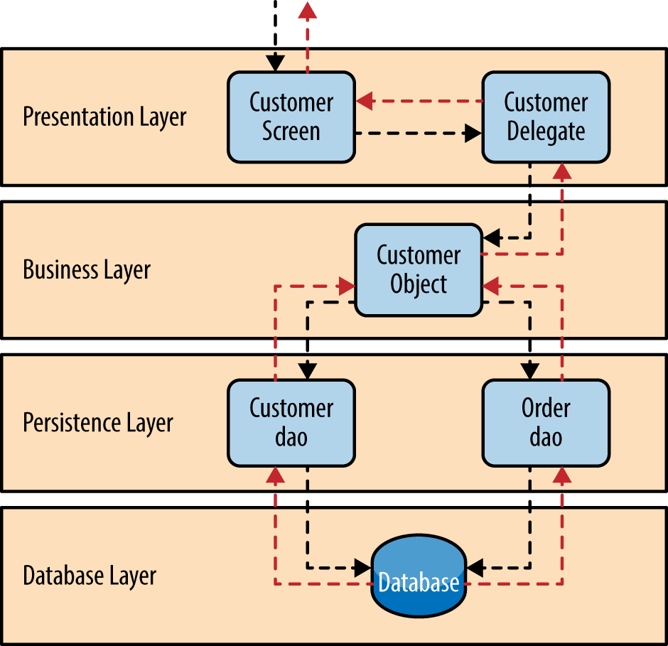
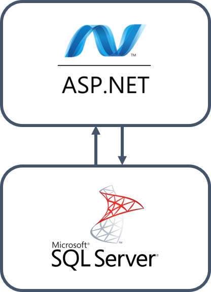
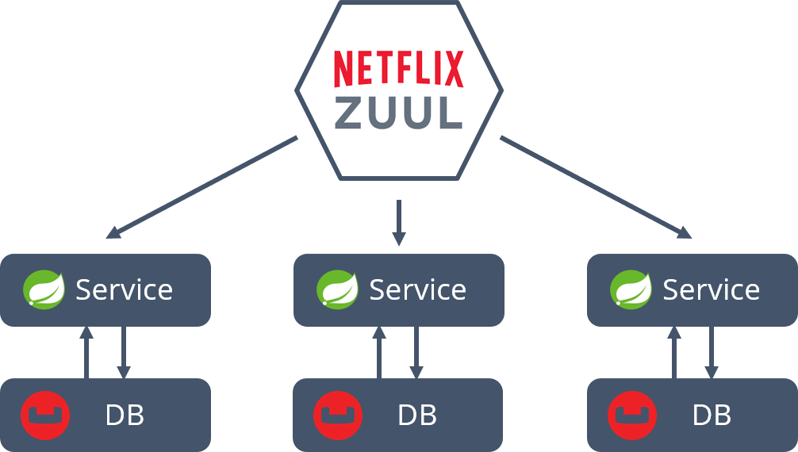

= Microservice Architecture and Distributed Systems
Ariel Simulevski <ariel@simulevski.at>
v1.0, 2018-12-31
:example-caption!:
:media: prepress
:icons: font
:source-highlighter: rouge

ifdef::backend-pdf[:imagesoutdir: ../../../build/asciidoc/{backend}/images]
ifdef::backend-pdf[:imagesdir: ../../../build/asciidoc/{backend}/images]

// this renders a dynamic table of content
:toc:

== Introduction

=== Distributed Systems

=== System Architectures

=== Structure of this Thesis

== Abstract

<<<

== Application Architectures

=== Monolithic Architectures

A monolithic architecture describes the structure of a system which houses the entire backend of a platform. Every part of the backend (persistence, business-logic, UI, etc...) is contained in this single program. <<monolith>>

One central paradigm of monoliths is layered architecture. Layered architecture describes a concept in which a program consists of multiple layers, each responsible for a specific thing with very limited interaction between said layers. <<layered-architecture>>

.Layered architecture pattern
[#img-monolith]
[caption="Figure 1: "]

==== Advantages

Although the concept of monolithic architecture is quite old, it still has decisive advantages over other architectures.

Due to the simplicity in architectural design, a monolith is very easy to develop, the layered architecture also allows for the application to be simple to test and the deployment of monolithic systems is also fairly straightforward: the binary of the program simply has to be copied to the target machine and then be executed. <<monolith>>

==== Drawbacks

That being said, due to some aspects of monolithic architecture, this architectural style has become unviable to most and even an antipattern to some. <<monolith-codingthearchitecture>>

Monolithic systems can become very complex to understand. Especially for new developers and fast growing projects, this is a big problem. Furthermore, an instance of a monolithic system cannot be updated without the instance shutting down. And due to the strongly-coupled nature of monoliths, unknown code dependencies might make the system crash because of a single change. <<monolith>> <<monolith-doomed>>

Even though, the drawbacks of monoliths outweigh the advantages, monolithic architecture is still widely used in smaller projects, legacy systems or projects which lack the necessary financial resources for a more advanced software architecture.

A typical monolithic architecture stack from Microsoft could look like so:

.Microsofts monolithic architecture stack
[#img-msstack]
[.center]
[caption="Figure 2: "]

This is a fairly well known software stack from Microsoft. The described architecture uses ASP.NET as the system framework and Microsoft SQL Server as the database.

=== Microservice Architectures

Microservices have been the "architectural answer" to monoliths. Coined by Dr. Peter Rogers during a cloud computing conference, the term "micro web services" first described the idea of loosely coupled services which run independently and can each be maintained and developed individually. <<microservices-history>>

The term "microservice" was first used at a conference in Venice in 2011. In 2012 the architectural style gained more popularity. At a talk at a conference in Krakow (Micro services - Java, the Unix Way <<microservices-krakow>>), James Lewis presented his ideas on the topic. Later that year Adrian Cockcroft of Netflix described microservices as "fine-grained SOA" and helped establish a microservice architecture at Netflix, thus pioneering the architecture at scale. <<microservices-fowler>> <<microservices-medium>>

As Lewis described in 2012, microservices are "small with a single responsibility". This means that each microservice (or each application in the system) only does a single thing. According to Lewis, a microservice should be "Small enough to fit in [ones] head". The usecases of a single microservice are supposed to be so small, that one can think about all of them at the same time.

==== Advantages

Microservices were always seen as a successor to monoliths. <<microservices-history>> Therefore, they attempt to solve many of the problems that the monolithic architecture has. Due to each microservice being, relatively, small, the risk of a system becoming too complex for new developers to understand is kept to a minimum. The small, single responsibility nature of microservices allows for on-the-fly updating through CI/CD. Furthermore, microservices allow for language agnostic development. That means that one can use multiple programming languages and runtimes in one project to best suit the need of specific usecases/functions. <<monolith>> <<microservices-cicd>> <<microservices-dzone>>

==== Drawbacks

Of course, microservices are not the be-all and end-all of backend architecture and therefore do have some problems.

The added complexity of having to deal with distributed systems and inter-service communication might add difficulties to getting started with microservices. Due to having more applications in a single system, initial deployment may get difficult and very complex. And lastly, because of having more runtime instances, idle resource consumption with microservices is also significantly higher. <<monolith>>

[stem]
++++
c_"mon" = (\sum_{i=0}^l n_i)+m
++++

This formula describes the resource consumption of a monolith where stem:[n_i] is the resource consumption of a layer (at idle), stem:[l] is the number of layers and stem:[m] is the resource consumption of a runtime instance. As one can see, there is only one runtime instance, no matter how many layers there are.

[stem]
++++
c_"ms" = \sum_{i=0}^l (n_i+m_i)
++++

This formula describes the resource consumption of a system built on microservice architecture. Here, the cost of the runtime instance is added to every layer (or in that case service) one adds to the system.

The architecture for a system which builds upon a microservice architecture could look like this:

.Netflix microservice architecture stack
[#img-microservices]
[caption="Figure 2: "]

This implementation of the microservice architecture utilizes the Netflix stack. The Netflix stack is a collection of libraries to make dealing with microservices easier. At the top of the architecture, there is the API gateway (the service that forwards requests to the services based on their route). Down below, there are the actual services with their corresponding databases (Couchbase in this particular example). Microservices do not always need to have their own database, but can also all have the same database.

=== Serverless Architectures

Serverless architecture was created out of the need for more efficient scalability out-of-the-box.
//TODO

== Scaling Architectures in Distributed Systems

=== Monolithic

Since the monolithic architecture only scales through a replicated database, the cost function for a scaled monolith where stem:[s] is the number of machines the monolith is running on, stem:[c_{lb}] is the cost of the load-balancing forward and stem:[c_{"net"}] is the cost of the network communication, could look like so:

[stem]
++++
c_{"scaled"_{"mon"}} = s*((\sum_{i=0}^l n_i)+m) + b + nc
++++

Even though, scaling a monolith is quite efficient, due to the fact that one is not able to run scale individual monolith instances, one has to scale the entire monolith if one part of the domain model experiences a random hit. This means some parts of a monolith might not be used at all when scaling and scaling them is just a side-effect of wanting to scale one particular part of the system, which, in-turn, means unused resourced and higher cost.

=== Microservices

Microservice architecture, on the other hand, scales both through the replication of th e database, as well as the replication of individual services (based on the load of these services).

This means that the runtime cost of a system utilizing microservice architecture could be described as such:

[stem]
++++
c_{"scaled"_{ms}} = \sum_{i=0}^s(\sum_{j = 0}^{ms_{"total"}} (ms_{ij}*(n_j+m_j))) + c_{lb} + c_{"net"}
++++

Where stem:[ms_"total"] is the number of individual microservices, stem:[ms_{ij}] is the number of instances of a specific microservice on a specific machine.

As one can deduct from the formulae above, scaling a monolith can be less expensive than scaling microservices if said microservices are all scaled at the same rate. This barely ever happens in a real production system, thus microservice architecture, with a varying scaling rate of each microservice, is often preferred over monolithic architecture.

=== Serverless

== Scaling Across Datacenters

//TODO: Write about DC/OS, Kubernetes; explain Cloud concepts

== Implementation of Social Networks

//TODO: Historic implementations: Facebook, MySpace, IRC - social network architectures over the years

=== General Aspects on Implementing Social Networks

//TODO: About scalability, security, location (access speed - geo load balancing)

=== Initial Microservice Implementation

//TODO: Explain why we chose microservices

==== System Architecture

//TODO: Add OUR architecture map & explain

==== Experience

//TODO: Explain that it was too expensive & too much too develop & not enough hr was available

==== Issues and Limitations

=== Moving to Serverless Implementation

==== Modified System Architecture

=== Comparison of Microservices and Serverless

== Results and Learnings

== Conclusion

<<<
[bibliography]
== References

- [[[monolith,1]]] Introduction to Monolithic Architecture and MicroServices Architecture: https://medium.com/koderlabs/introduction-to-monolithic-architecture-and-microservices-architecture-b211a5955c63
- [[[layered-architecture,2]]] 1. Layered Architecture - Software Architecture Patterns [Book]: https://www.oreilly.com/library/view/software-architecture-patterns/9781491971437/ch01.html
- [[[monolith-codingthearchitecture,3]]] What is a Monolith? - Coding the Architecture: http://www.codingthearchitecture.com/2014/11/19/what_is_a_monolith.html
- [[[monolith-doomed,4]]] Are Monolithic Software Applications Doomed for Extinction? - Nortal: https://nortal.com/de/blog/are-monolithic-software-applications-doomed-for-extinction/
- [[[microservices-history,5]]] Microservices: What They Are and Why Use Them: https://blog.leanix.net/en/a-brief-history-of-microservices
- [[[microservices-krakow,6]]] 33rd Degree - Conference for Java Masters - Micro services - Java, the Unix Way: http://2012.33degree.org/talk/show/67; http://2012.33degree.org/pdf/JamesLewisMicroServices.pdf
- [[[microservices-fowler,7]]] Microservices: https://martinfowler.com/articles/microservices.html
- [[[microservices-medium,8]]] Talking microservices with the man who made Netflix’s cloud famous: https://medium.com/s-c-a-l-e/talking-microservices-with-the-man-who-made-netflix-s-cloud-famous-1032689afed3
- [[[microservices-cicd,9]]] Continuous Deployment and Monitoring of Microservices - DevOps.com: https://devops.com/continuous-deployment-monitoring-microservices/
- [[[microservices-dzone,10]]] - Monolithic vs Microservice Architecture - DZone Integration: https://dzone.com/articles/monolithic-vs-microservice-architecture
