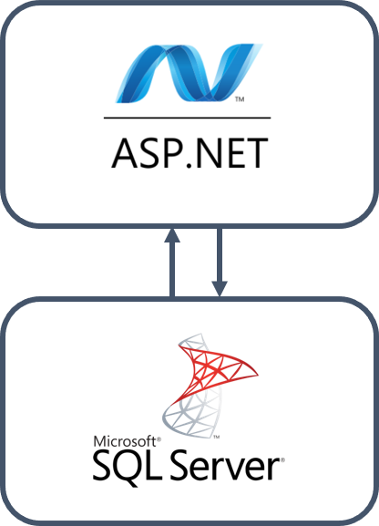
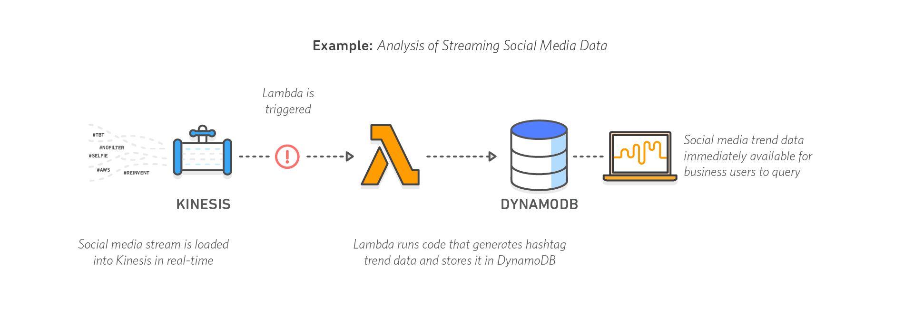

= Microservice Architecture and Distributed Systems
Ariel Simulevski <ariel@simulevski.at>
v0.1, 2019-03-24
:toc: macro
:math:
:media: prepress
:icons: font
:source-highlighter: rouge
:stem: latexmath

<<<

== 1. Abstract

In this work I discuss the creation of a highly scalable social media network. I will present different approaches to backend design, explain their background, advantages and disadvantages and show a typical example of such an architecture. Furthermore, I will present both our initial backend implementation, based on microservices, why we switched to a serverless approach and show performance benchmarks of serverless scaling. We found out that serverless architecture made it significantly easier to build, deploy and manage highly scalable applications. Its scaling properties make it superior (scaling wise) to both microservices and monoliths.

<<<

== 2. Introduction

With the rapid move to cloud technologies, architectural patterns and software design have become an increasingly important aspect of the cloud native movement. We have been given the task of designing a social media network for our partner Initiative Interchange <<ii>>, a daughter organizations of Rotary International <<rotary>> and Unicef <<unicef>> partner.

Initiative Interchange is an organization with the goal of making charity work more accessible and at the same time connect Rotary Interact members all over the world. The social network is supposed to give information on upcoming events, get reports on project funding and get the latest news from Rotary Interact clubs that are nearby. Furthermore, one can see posts and updates from fellow Rotary Interact members from around the world.

Since the organization has members all over the planet, the social network was supposed to be both highly scalable and available (with constant access speeds all across the globe). This paper shows the design process and theoretical aspects of such an architecture.

=== 2.1 Distributed Systems

[quote, Stanislav Kozlovski, A Thorough Introduction to Distributed Systems [4] ]
A distributed system in its most simplest definition is a group of computers working together as to appear as a single computer to the end-user.

As server demands grow, the need for computational power does as well. The challenge, making multiple systems work together to form a single platform which acts like a single machine towards to the user is a highly discussed and seldomly mastered one. One of our tasks was to make our platform highly scalable by utilizing distributed systems and system scaling <<distributed>>.

=== 2.2 System Architectures

A system architecture (sometimes called "cloud architecture" or "cloud design") describes both the way one instance in a system looks, as well as how the entities in a distributed system scale <<system-arch>> <<cloud-arch>>. An analogy: if distributed systems are the house, the foundation, the yard; then system architecture is the blueprint.

=== 2.3 Structure of this Thesis

In this thesis, I will first show the theoretics of designing a cloud architecture (chapter <<3. Application Architectures, 3>>, <<4. Scaling Architectures in Distributed Systems, 4>> and <<5. Scaling Across Datacenters, 5>>). After that, I will go into general aspects of designing and developing a social network and analyze an existing social networking platform (<<6. Cloud architecture in Initiative Interchange,6.>>, <<7. Implementation of Social Networks, 7.>>, <<7.1 General Aspects on Implementing Social Networks,7.1>>). I will conclude with both our initial approach and final cloud design (<<7.2 Initial Microservice Implementation,7.2>>, <<7.3 Moving to Serverless Implementation, 7.3>>, <<7.4 Cloud Configuration, 7.4>>, <<7.5 Comparison of Microservices and Serverless, 7.5>>).

<<<

== 3. Application Architectures

In this chapter, I am going to present different application architectures. I will explain their advantages, disadvantages and present sample tech stacks that are typical for that architecture.

=== 3.1 Monolithic Architectures

A monolithic architecture describes the structure of a system which houses the entire backend of a platform. Every part of the backend (persistence, business-logic, UI, etc.) is contained in this single program. <<monolith>>

One central paradigm of monoliths is layered architecture. Layered architecture describes a concept in which a program consists of multiple layers, each responsible for a specific thing with very limited interaction between said layers. <<layered-architecture>>

.Layered architecture pattern <<layered-architecture,[8]>>
[#img-monolith]
[caption="Figure 1: "]
image::../images/LayeredArchitecture.png[align=center, pdfwidth=10cm]

==== 3.1.1 Advantages

Although the concept of monolithic architecture is quite old, it still has decisive advantages over other architectures.

Due to the simplicity in architectural design, a monolith is very easy to develop, the layered architecture also allows for the application to be simple to test and the deployment of monolithic systems is also fairly straightforward: the binary of the program simply has to be copied to the target machine and then be executed. <<monolith>>

<<<
==== 3.1.2 Drawbacks

That being said, due to some aspects of monolithic architecture, this architectural style has become unviable to most and even an antipattern to some. <<monolith-codingthearchitecture>>

Monolithic systems can become very complex to understand. Especially for new developers and fast growing projects, this is a big problem. Furthermore, an instance of a monolithic system cannot be updated without the instance shutting down. And due to the strongly-coupled nature of monoliths, unknown code dependencies might make the system crash because of a single change. <<monolith>> <<monolith-doomed>>

Even though, the drawbacks of monoliths outweigh the advantages, monolithic architecture is still widely used in smaller projects, legacy systems or projects which lack the necessary financial resources for a more advanced software architecture.

A typical monolithic architecture stack from Microsoft could look like so:

.Microsofts monolithic architecture stack
[#img-msstack]
[caption="Figure 2: "]


This is a fairly well known software stack from Microsoft. The described architecture uses ASP.NET as the system framework and Microsoft SQL Server as the database.

<<<
=== 3.2 Microservice Architectures

Microservices have been the "architectural answer" to monoliths. Coined by Dr. Peter Rogers during a cloud computing conference, the term "micro web services" first described the idea of loosely coupled services which run independently and can each be maintained and developed individually. <<microservices-history>>

The term "microservice" was first used at a conference in Venice in 2011. In 2012 the architectural style gained more popularity. At a talk at a conference in Krakow (Micro services - Java, the Unix Way <<microservices-krakow>>), James Lewis presented his ideas on the topic. Later that year Adrian Cockcroft of Netflix described microservices as "fine-grained SOA" and helped establish a microservice architecture at Netflix, thus pioneering the architecture at scale. <<microservices-fowler>> <<microservices-medium>>

As Lewis described in 2012, microservices are "small with a single responsibility". This means that each microservice (or each application in the system) only does a single thing. According to Lewis, a microservice should be "Small enough to fit in [ones] head". The usecases of a single microservice are supposed to be so small, that one can think about all of them at the same time.


==== 3.2.1 Advantages

Microservices were always seen as a successor to monoliths <<microservices-history>>. Therefore, they attempt to solve many of the problems that the monolithic architecture has. Due to each microservice being, relatively, small, the risk of a system becoming too complex for new developers to understand is kept to a minimum. The small, single responsibility nature of microservices allows for on-the-fly updating through CI/CD. Furthermore, microservices allow for language agnostic development. That means that one can use multiple programming languages and runtimes in one project to best suit the need of specific usecases/functions <<monolith>> <<microservices-cicd>> <<microservices-dzone>>.

==== 3.2.2 Drawbacks

Of course, microservices are not the be-all and end-all of backend architecture and therefore do have some problems.

The added complexity of having to deal with distributed systems and inter-service communication might add difficulties to getting started with microservices. Due to having more applications in a single system, initial deployment may get difficult and very complex. And lastly, because of having more runtime instances, idle resource consumption with microservices is also significantly higher <<monolith>>.

[stem]
++++
c_{mon} = (\sum_{i=0}^l n_i)+m
++++

This formula describes the resource consumption of a monolith where stem:[n_i] is the resource consumption of a layer (at idle), stem:[l] is the number of layers and stem:[m] is the resource consumption of a runtime instance. As one can see, there is only one runtime instance, no matter how many layers there are.

<<<
[stem]
++++
c_{ms} = \sum_{i=0}^l (n_i+m_i)
++++

This formula describes the resource consumption of a system built on microservice architecture. Here, the cost of the runtime instance is added to every layer (or in that case service) one adds to the system.

The architecture for a system which builds upon a microservice architecture could look like this:

.Netflix microservice architecture stack
[#img-microservices]
[caption="Figure 2: "]
image::../images/MicroserviceArchitectureSpring.png[align=center]

This implementation of the microservice architecture utilizes the Netflix stack. The Netflix stack is a collection of libraries to make dealing with microservices easier. At the top of the architecture, there is the API gateway (the service that forwards requests to the services based on their route). Down below, there are the actual services with their corresponding databases (Couchbase in this particular example). Microservices do not always need to have their own database, but can also all have the same database.

<<<
=== 3.3 Serverless Architectures

Serverless architecture was created out of the need for more efficient scalability out-of-the-box <<fowler-serverless>>. This is achieved by sizing down the unit of compute from services to so-called "functions", "hooks" or "lambdas" (the smallest possible unit of compute size in high level programming) <<fowler-serverless>> <<serverless-bw>>. Essentially, the serverless architecture pattern is a kind of microservice architecture (every serverless function still has a layered architecture, if a very cut-down one).

.Gartner hype cycle 2017 <<hypecycle, [19]>>
[#img-hypecycle]
[caption="Figure 3: "]


Serverless architecture is a very new concept. According to the Gartner Hypecycle of Emerging Technologies 2017 <<hypecycle>> (see: above), serverless architecture is still a very new and immature technology. So young even, that it, as of July 2017, was not even in its hype phase ("Peak of Inflated Expectation") with an estimated time-to-plateau of 2 to 5 years. This means that at earliest, serverless technology will be nearing maturity in early Q3 of 2019 and latest in early Q3 of 2023.

The design process of serverless applications is a bit more abstract than that of monoliths or microservices, since we do not work with controllers or typical response models, but rather with functions and events.

.Serverless functions <<serverless-cb,[20]>>
[#img-slaws]
[caption="Figure 4: "]


This diagram shows the flow of a serverless function <<serverless-cb>>. The dispatcher, in this case AWS Kinesis <<aws-kinesis>>, a real time analysis tool, triggers an AWS Lambda <<aws-lambda>> function through a direct call. The serverless function, then inserts data into the database, AWS DynamoDB <<aws-dynamodb>> in this case, and returns a result.

The difference to microservices here is that the serverless function can not do anything else than that one specific task, while a microservice of a specific domain can do multiple tasks and fulfill multiple use-cases.

==== 3.3.1 Advantages

//TODO

Since serverless architecture was specifically designed to be more efficient at scale, the obvious advantage is scaling performance. Serverless architecture provides the framework to deliver excellent scaling properties, including "scale to zero".

NOTE: "Scale to zero" means destroying all instances of a service. As soon as someone tries to access the service, an instance get spun up again. <<scale2zero>>

Due to the fact that serverless frameworks take over most of the management aspects of deploying and maintaining operations, serverless architecture is easy to maintain; some would say a "no maintenance" system <<serverless-cb>>.

//easy to develop

==== 3.3.2 Drawbacks

//TODO
//lock in
//less control (websockets, etc...)
//imaturity (no right way of doing stuff)

== 4. Scaling Architectures in Distributed Systems

This chapter is about scaling behaviour in different application architectures and difficulties in scaling with said architectures. I will also go into benchmarks I made on serverless scaling and serverless scaling performance.

=== 4.1 Monolithic

Since the monolithic architecture only scales through a replicated database, the cost function for a scaled monolith where stem:[s] is the number of machines the monolith is running on, stem:[c_{lb}] is the cost of the load-balancing forward and stem:[c_{net}] is the cost of the network communication, could look like so:

[stem]
++++
c_{scaled_{mon}} = s*((\sum_{i=0}^l n_i)+m) + b + nc
++++

Even though, scaling a monolith is quite efficient, due to the fact that one is not able to run scale individual monolith instances, one has to scale the entire monolith if one part of the domain model experiences a random hit. This means some parts of a monolith might not be used at all when scaling and scaling them is just a side-effect of wanting to scale one particular part of the system, which, in-turn, means unused resourced and higher cost.

=== 4.2 Microservices

Microservice architecture, on the other hand, scales both through the replication of the database, as well as the replication of individual services (based on the load of these services).

This means that the runtime cost of a system utilizing microservice architecture could be described as such:

[stem]
++++
c_{scaled_{ms}} = \sum_{i=0}^s(\sum_{j = 0}^{ms_{total}} (ms_{ij}*(n_j+m_j))) + c_{lb} + c_{net}
++++

Where stem:[ms_total] is the number of individual microservices, stem:[ms_{ij}] is the number of instances of a specific microservice on a specific machine.

As one can deduct from the formulae above, scaling a monolith can be less expensive than scaling microservices if said microservices are all scaled at the same rate. This barely ever happens in a real production system, thus microservice architecture, with a varying scaling rate of each microservice, is often preferred over monolithic architecture.

=== 4.3 Serverless

Scaling serverless systems looks very similar to microservice scaling. The major difference here is, of course, the unit of compute. This means that the base cost of serverless scaling is even higher (because serverless architecture requires more runtime instances to achieve the same result) than for a microservice architecture. Therefore, using serverless makes the most sense when the base cost of a system does not matter and only scaling performance is relevant.

=== 4.4 Difficulties with scaling

As previously mentioned, both the monolithic architecture as well as microservice architecture do encounter some efficiency problems while scaling. The reason for that are the deployment containers one typically uses when dealing with monolith/microservice scaling (VMs and containers). When scaling VMs or containers, we always deal with threshold based scaling <<threshold-scaling>>. This means that we scale (add or remove) a deployment based on system resources used. Generally, we define both a lower threshold (~25% CPU load) and an upper threshold (~80% CPU load) for our system.

When every instance of our deployment reaches that upper threshold (with equal distributed load balancing, this should happen simultaneously), we add another VM/container to lower the load on other deployment instances to prevent system crashes or downtime.

The graph bellow shows a visual representation of the same computational space utilized in different manners. The white portion of each block symbolizes unused resources (overhead).

.Scaling overhead
[#img-scalingoverhead]
[.center]
[caption="Figure 4: "]


This also means, that one can never use more than the upper threshold defined for an operation, thus not utilizing the full potential of ones computational resources. The serverless architecture pattern solves that problem by shrinking down the unit of compute to the smallest possible size (functions), thus allowing more instances with a higher scaling threshold.

.AWS Lambda Response Time Distribution (P50-P95) <<serverless-scaling,[26]>>
[#img-lambdaspeed]
[.center]
[caption="Figure 5: "]


This graph shows the response time of an AWS Lambda function under load. As one can see, the median response (P50) remained stable during the entire test-run with even the 90th and 95th percentile showing close to no variance <<serverless-scaling>>.

//TODO: Mention reproduction of this graph. Explain reproduction of this study.

== 5. Scaling Across Datacenters

When scaling applications, one can reach the limit of their own data center quite fast. To overcome the limits of on-premise compute resources, people often rent compute resources in external data centers and clouds like the Google Cloud <<gcloud>>, Amazon AWS <<aws>> or Microsoft Azure <<azure>>.

This "computation-outsourcing" is often referred to as a "hybrid cloud" compared to having all compute resources on-premise ("private cloud") or having all compute resources in the cloud or external data centers ("public cloud" or "cloud native").

Although hybrid and public cloud systems seem to solve many problems with private cloud computing, like having to maintain less hardware yourself, being cheaper (to a certain point <<public-vs-private-cloud>>) and having SLA's in place which ensure uptime <<public-cloud-pro>>, there are some difficulties in hybrid/public clouds.

Things like integration complexity, network design or scale management can complicate a deployment or prevent a successful deployment altogether. <<hybrid-cloud-challenges>>

To overcome these problems many companies launched their own day-2 <<day-2>> management solutions like DC/OS <<dcos>> <<why-dcos>> or OpenShift <<openshift>>.

.DCOS Hybrid cloud <<dcos-hybrid,[37]>>
[#img-dcoshybrid]
[.center]
[caption="Figure 6: "]


This image shows a DC/OS cluster which is deployed on a hybrid cloud <<dcos-hybrid>>. Some nodes (including the master nodes which act as the orchestrators <<orchestration-wiki>> for the system) are running on-premise, while others are running on different public clouds.

== 6. Cloud architecture in Initiative Interchange

As we wanted low latency access for all of our users (including, but not limited to,  users in Canada , US, El Salvador, Mexico, Brazil, Argentina, Uruguay, Venezuela, Peru, Austria, Switzerland, Germany, France, Italy and Ukraine) and did not have enough money to launch a private cloud or enough knowledge to design our own public cloud infrastructure, we chose to deploy our application on AWS and utilize AWS infrastructure services (load balancing via AWS ELB <<aws-elb>>; networking via AWS VPC <<aws-vpc>>; global load balancing and DNS resolving via AWS Route 53 <<aws-r53>>; VMs on AWS EC2 <<aws-ec2>>) to our advantage.

Our initial approach was using DigitialOcea <<digitalocean>>  with DC/OS. This solution would have given us finer control over our application and VMs, and even though DigitalOcean was cheaper (8 CPUs, 32 GB RAM - DigitalOcean<<do-price>>: $0.238/hr; AWS<<aws-price>>: $0.384/hr), it was ultimately written off as it would have been more complicated to set up and did not offer the same enterprise grade features and locations as AWS did.

== 7. Implementation of Social Networks

One of the best example of how social network architecture changed over the years is Facebook. Facebook started out with the very common PHP+MySQL stack all running on an Apache WebServer <<apache-server>>. This comes as no surprise as both PHP and MySQL are two of the most used technologies for web development. <<php-usage>> <<mysql-usage>>

Over the years, Facebook has adopted its tech stack to their higher demand but their underlying technology still is PHP and MySQL. Instead of using the Apache WebServer, Facebook developed a PHP runtime which converts PHP into bytecode for HHVM (**H**ip**H**op**V**irtual**M**achine), which then converts said bytecode into native x64 machine code. <<hhvm>>

Facebook has retired using MySQL as a relational database and is now using MySQL as a pure key-value store and Memcached <<memcached>> as a database cache to speed up read performance. <<fb-stack>>

Furthermore, Facebook developed their own storage/retrieval system called Haystack <<haystack-paper>> and is also using Hadoop <<hadoop>> and Hive as their big data storage/computation system. <<fb-stack>>

Facebooks architecture is one of the most impressive tech stacks currently in action. It has developed from a single $85/month server system <<fb-first-server>> to a giant platform with own data centers to fuel their operation. We tried to learn from Facebooks scaling experiences and design our architecture to have first class scaling support.

=== 7.1 General Aspects on Implementing Social Networks

As previously mentioned, scaling is one of the most important challenges a social network faces. While a social network has to be fast and resource-optimized, one also has to keep cost in mind.

Since Initiative Interchange has members in 5 continents, we needed to ensure access speeds for our users.

.Client side load balacing
[#img-clientlb]
[.center]
[caption="Figure 7: "]


Initially, we tried to do so by balancing the load from the client side with Netflix Ribbon (as you see in the picture above) but we changed our load balancing strategy to a DNS based one <<dns-lb>>, once we had to revise our backend architecture.

Another important aspect to keep in mind is security. Both user data, as well as servers have to be kept secure. With a privacy-by-design based approach in mind, we tried to carefully design our backend and security strategy to be in line with the EU-GDPR. In the end, we abandoned our initial security strategy and used an external one instead.

=== 7.2 Initial Microservice Implementation

To solve all of the above mentioned problems, we wanted to chose a technology with which we were familiar and which was sufficiently mature and advanced to suit even our more unusual design choices (like client side load balancing and polyglot persistence).

Microservice seemed like the only feasible option since we were not aware of serverless technology and a monolithic architecture was not an option since we had to ensure efficient and cost-effective scalability of our platform.

<<<
==== 7.2.1 System Architecture

.Initial Initiative Interchange backend architecture
[#img-i2springarch]
[.center]
[caption="Figure 8: "]


This architecture map shows the initial architecture design of our project. The underlying technology we are using is Spring Boot <<spring>>, a Java framework for enterprise-grade web applications. At the top of the map, one can see our API gateway and proxy: Netflix Zuul <<netflix-zuul>>. All services (including our authentication service) register to Zuul via Netflix Eureka <<netflix-eureka>>, a registry service for Spring Boot microservices.

Our authentication service (built with Spring Security) is in the layer bellow. Next to the authentication service, one can see all of our other services (also written in Spring Boot). All of our services are connected to a Logstash <<logstash>> instance which collects the logs of our services and sends them to an Elasticsearch <<elastic>> instance on a remote server so they can be analyzed and later visualized by Kibana <<kibana>>.

We have opted to use a polyglot persistence approach. Not only was one of our partners requirements was to display the closest relation between stem:[n] people, but we also found a polyglot persistence approach, where one database managed relations and another stores data, the most reliable for a highly scalable social network.

Say we have a group of people, A-J. We want to know the closest connection between A and D (in this case: A-> G -> D).

.Friends diagram
[caption="Figure 9: "]
[align=center]
[graphviz,frienddia,svg]
---------------------------------------------------------------------
digraph G {
    A -> B;
    A -> F;
    A -> G;
    F -> E;
    B -> C;
    B -> J;
    J -> G;
    B -> E;
    F -> I;
    I -> H;
    E -> D;
    E -> H;
    H -> D;
    C -> G;
    G -> D;
    C -> D;
}
---------------------------------------------------------------------

.Neo4j vs MySQL query time comparison
[#img-neo4jcomp]
[.center]
[caption="Figure 10: "]


The graph above shows the response time of both MySQL as well as Neo4j for such a use-case in a database with 1,000,000 users <<neo4j-mysql-friends>>. As one can see, the relational database did not even finish on a depth of 5.

We chose Couchbase <<couchbase>> because of its XDCR (**C**ross-**D**ata-**C**enter-**R**eplication), full-text-search and high-availability features.

==== 7.2.2 Experience

Our experience with Spring Boot and the Netflix stack was very pleasant. There is a plenty of documentation, both from Pivotal <<spring-pivotal>> and external sources <<spring-baeldung>>. We did not encounter any instabilities and even more experimental aspects of our project, like polyglot persistence, were very stable.

==== 7.2.3 Issues and Limitations

The major issues we encountered were not the fault of our technology stack. A couple of sprints into our project, one of our team-members had to leave our team. Due to that circumstance, we did not have enough human resources to complete the backend in time. Additionally, our project partner was not able to secure the necessary funding to deploy the project.

=== 7.3 Moving to Serverless Implementation

Since we needed a new solution which would allow us to develop and deploy the backend with less human and financial resources than planned, we started research on alternatives to Spring Boot and, eventually, microservice architecture. In late December of 2018, we discovered serverless architecture and started assessing whether or not it would be a good fit for us and our project.

Most of our time savings came from not having to configure AWS Lambda. The scaling aspect of AWS Lambda is a built-in feature. Both service discovery and service gateway are managed by AWS and the AWS Route 53 requires very minimal configuration for the global load balancing.

Porting existing code to serverless was fairly trivial. Layered architecture still exists in a serverless environment, if a bit smaller. The major difference we had to get used to was the big focus on callback functions. The Spring Boot controllers were swapped with serverless hooks.

In the following code-examples, I will write a controller, service and repository in both Spring Boot with Java and AWS Lambda with JavaScript. The example bellow is a simple GET function which returns a domain object (in this case: a `StatusUpdate`).

<<<
==== 7.3.1 Controller

.Controller in Spring Boot
```java
@Controller
public class StatusUpdateController {

    @Autowired
    private StatusUpdateService statusUpdateService;

    @RequestMapping(value = " /statusupdate/{id}", method=RequestMethod.GET)
    @ReponseBody
    public String getPost(@PathVariable String id) {
        return statusUpdateService.getById(id);
    }
}
```

.Hook in AWS Lambda
```js
var statusUpdateService = require("./service/statusUpdateService.js");

exports.handler = function(event, context, callback) {
    statusUpdateService.getById(event.id, function(error, data){
        callback(error,data);
    });
};
```

The difference between Spring Boot and AWS Lambda is already apparent in the controller.

In Spring Boot, the function is registered with an annotation, `@RequestMapping(value = " /statusupdate/{id}", method=RequestMethod.GET)` while the registration of the serverless function is not done in code. Instead, one has to register the function over the AWS console web-interface.

Spring Boot offers built in dependency injection which we utilize by using the `@Autowired` annotation to automatically inject the `StatusUpdateService`. AWS Lambda does not offer DI, so one has to import the service functions into a JavaScript object to make use of them.

After calling the service to retrieve the data, Spring Boot returns the data as HTTP response (which is made possible by the `@ReponseBody` annotation). AWS Lambda on the other hand uses a callback function, often seen in JavaScript application.

<<<
==== 7.3.2 Service

.Service in Spring Boot
```java
@Service
public class StatusUpdateService{

    @Autowired
    private StatusUpdateRepository statusUpdateRepository;

    public StatusUpdate getById(String id){
        StatusUpdate statusUpdate;

        statusUpdateRepository.findById(id).ifPresentOrElse(
            value -> {
                statusUpdate = value;
                value.setId("");
            },
            () -> {
                statusUpdate = null;
            }
        );

        return statusUpdate;
    }
}
```

.Service in AWS Lambda
```js
var statusUpdateRepository = require("./persistence/statusUpdateRepository.js");

exports.getById = function(id, callback){
    statusUpdateRepository.findById(id, function(error, data){
        if(error) callback(error, null);

        delete data.id;
        callback(null, data);
    });
};
```

In the service, Spring Boot uses dependency injection again to get an instance of the repository while the functions exposed by the repository have to be imported manually in AWS Lambda.

In Java, we can make use of the `Optional` API to return `null` if we can not find the object, while in JavaScript, we use the well-known `if(error)` idiom to return null if our repository errored. We also use the `Optional` API to set the `id` parameter to an empty string, while in JavaScript, we simply delete the property.

<<<
==== 7.3.3 Repository

.Repository in Java with Spring JPA
```java
@Repository
public interface StatusUpdateRepository extends JpaRepository<StatusUpdate, String> {
    Optional<StatusUpdate> findById(String id);
}
```

.Repository in JavaScript
```js

var mysql = require('mysql');
var con = mysql.createConnection({
    host: 'localhost',
    user: 'me',
    password: 'secret',
    database: 'i2db'
});

exports.findById(id, callback){
    con.connect();

    con.query("SELECT * FROM `StatusUpdate` WHERE `id` = ?", [id],
    function (error, results, fields){
        if (error) callback(error, null);
        callback(null, results[0]);
    });

    con.end();
}
```

In Java with Spring Boot, repositories are fairly simple due to Spring Data JPA. Thanks to Spring Data JPA, one simply has to declare an interface which extends `JpaRepository<DomainObject, Key>`, in this case: `JpaRepository<StatusUpdate, String>`. The queries are automatically generated by Spring Data JPA based on the function names in the interface. The connection is configured in the `application.properties` file.

In JavaScript, we have to use the `mysql` library and manually write the SQL query, a simple prepared statement in this case. The connection has to be created manually (this can, of course, be outsourced into another file, but this is not supported by AWS Lambda out-of-the-box). The `mysql` library uses callbacks, just like AWS Lambda does.

<<<
==== 7.3.3 Modified System Architecture

.New Initiative Interchange backend architecture
[#img-i2awsarch]
[.center]
[caption="Figure 11: "]


The image above shows our new architecture map. Due to the fact that we are using a serverless approach, the architecture map is a very abstract version of our technology stack.

In the bottom-left corner, one can see our global load balancer and DNS web service, AWS Route 53. Here, we register all of our API endpoints and distribute requests based on location.

AWS Cognito (in the bottom-right corner) is responsible for the user management of our application. Initially, we wanted to write our own user management system, but we noticed quickly that using an external, well-tested solution would be both more secure and easier to adopt.

Above AWS Cognito, we have AWS API Gateway. While Route 53 manages requests on a global scale, API Gateway manages requests on a per-location basis. AWS API Gateway is responsible for sending every request to the correct controller, load balancing between internal controller instances (via AWS ELB), control CORS (**C**ross-**O**rigin-**R**esource-**S**haring) rules and manage our application staging.

Next to API Gateway, one can see the three main parts of our application, consisting of AWS Lambda, AWS RDS and AWS Neptune. These components all communicate via AWS VPC. AWS VPC also exposes AWS Lambda to the outside (although this is automatically routed by AWS). AWS Lambda is our serverless runtime, while AWS RDS and AWS Neptune are our two main databases. We kept our polyglot persistence approach from our initial architecture but had to switch out Couchbase with AWS RDS <<aws-rds>> and Neo4j with AWS Neptune <<aws-neptune>> for financial reasons. We will switch back too Couchbase and Neo4j as soon as the project gets more funding.

The yellow arrows bellow our main components symbolize the automatic scaling aspect of our application. AWS Lambda scales on a per-request basis while both AWS RDS and AWS Neptune scale by an EC2 scale policy <<aws-scaling>> (threshold based <<threshold-scaling>>).

=== 7.4 Cloud Configuration

//TODO: Add screenshots and descriptions of AWS config

=== 7.5 Comparison of Microservices and Serverless

When working with serverless architecture in AWS Lambda, we encountered some major differences to microservice architecture in Java with Spring Boot.

The biggest of them being the language agnostic nature of the serverless architecture pattern. It is definitely possible to use multiple languages in microservice architecture, but generally, mixing languages within a service is frowned upon. Due to the fact that serverless functions are closed system (every function is deployed on its own), polyglotism in within the serverless pattern is not only possible, but also easier to develop and to maintain.

This is made possible by the modularity of serverless functions. A key difference to microservices which allows rapid development and deployment of serverless applications.

== 8. Results and Learnings

<WIP>
//TODO: Great results (scaling benchmarks), we learned to port technology (???)

== 9. Summary and Conclusions

This paper describes our findings while developing the backend for what is supposed to be a highly scalable social media network.

We started out developing a microservice architecture as our cloud design. Due to organizational problems in our project team, we had to revise our software architecture. In this context we decided to redesign our cloud architecture and analyze different solutions and approaches to microservices. As we found out through scaling benchmarks, serverless architecture has very impressive scaling results and many other advantages over microservices so we decided to switch to a serverless approach.

While we can not draw a definite conclusion on what software architecture is ultimately better, we found the newer, less mature serverless architecture pattern to be very efficient while scaling, easy to develop and to maintain.

Serverless technology is very promising, if a bit hard to get into. With time, and as the technology matures, most of its flaws will fade away, giving the serverless architecture pattern the chance to be a real competitor to microservice architecture and eventually deprecate the latter.

<<<
[bibliography]
== 10. References

- [[[ii,1]]] Initiative Interchange: https://www.initiative-interchange.org/
- [[[rotary, 2]]] Home | Rotary International: https://www.rotary.org/en
- [[[unicef, 3]]] Home page | UNICEF: https://www.unicef.org/
- [[[distributed,4]]] A Thorough Introduction to Distributed Systems – freeCodeCamp.org: https://medium.freecodecamp.org/a-thorough-introduction-to-distributed-systems-3b91562c9b3c
- [[[system-arch, 5]]] What is Systems Architecture ?: https://www.lix.polytechnique.fr/~golden/systems_architecture.html
- [[[cloud-arch, 6]]] What is cloud computing architecture? | HCL Technologies: https://www.hcltech.com/technology-qa/what-is-cloud-architecture
- [[[monolith,7]]] Introduction to Monolithic Architecture and MicroServices Architecture: https://medium.com/koderlabs/introduction-to-monolithic-architecture-and-microservices-architecture-b211a5955c63
- [[[layered-architecture,8]]] 1. Layered Architecture - Software Architecture Patterns [Book]: https://www.oreilly.com/library/view/software-architecture-patterns/9781491971437/ch01.html
- [[[monolith-codingthearchitecture,9]]] What is a Monolith? - Coding the Architecture: http://www.codingthearchitecture.com/2014/11/19/what_is_a_monolith.html
- [[[monolith-doomed,10]]] Are Monolithic Software Applications Doomed for Extinction? - Nortal: https://nortal.com/de/blog/are-monolithic-software-applications-doomed-for-extinction/
- [[[microservices-history,11]]] Microservices: What They Are and Why Use Them: https://blog.leanix.net/en/a-brief-history-of-microservices
- [[[microservices-krakow,12]]] 33rd Degree - Conference for Java Masters - Micro services - Java, the Unix Way: http://2012.33degree.org/talk/show/67; http://2012.33degree.org/pdf/JamesLewisMicroServices.pdf
- [[[microservices-fowler,13]]] Microservices: https://martinfowler.com/articles/microservices.html
- [[[microservices-medium,14]]] Talking microservices with the man who made Netflix’s cloud famous: https://medium.com/s-c-a-l-e/talking-microservices-with-the-man-who-made-netflix-s-cloud-famous-1032689afed3
- [[[microservices-cicd,15]]] Continuous Deployment and Monitoring of Microservices - DevOps.com: https://devops.com/continuous-deployment-monitoring-microservices/
- [[[microservices-dzone,16]]] Monolithic vs Microservice Architecture - DZone Integration: https://dzone.com/articles/monolithic-vs-microservice-architecture
- [[[fowler-serverless, 17]]] Serverless Architectures: https://martinfowler.com/articles/serverless.html
- [[[serverless-bw, 18]]] Serverless Computing, Explained - Boolean World: https://www.booleanworld.com/serverless-computing-explained/
- [[[hypecycle, 19]]] Top Trends in the Gartner Hype Cycle for Emerging Technologies, 2017 - Smarter With Gartner: https://www.gartner.com/smarterwithgartner/top-trends-in-the-gartner-hype-cycle-for-emerging-technologies-2017/
- [[[serverless-cb, 20]]] Why “serverless” architecture isn’t the HOLY GRAIL (yet): https://codeburst.io/why-serverless-architecture-isnt-the-holy-grail-yet-94a095325fa4
- [[[aws-kinesis, 21]]] Amazon Kinesis: https://aws.amazon.com/kinesis/
- [[[aws-lambda, 22]]] AWS Lambda – Serverless Compute - Amazon Web Services: https://aws.amazon.com/lambda/
- [[[aws-dynamodb, 23]]] Amazon DynamoDB - Overview: https://aws.amazon.com/dynamodb/
- [[[scale2zero, 24]]] Scale to Zero and Back Again with OpenFaaS | OpenFaaS - Serverless Functions Made Simple: https://www.openfaas.com/blog/zero-scale/
- [[[threshold-scaling, 25]]] M. Mohan Murthy, H. Sanjay and Jumnal Anand. Threshold Based Auto Scaling of Virtual Machines in Cloud Environment https://hal.inria.fr/hal-01403090/document
- [[[serverless-scaling, 26]]] Serverless at Scale: Serving StackOverflow-like Traffic - Binaris Blog: https://blog.binaris.com/serverless-at-scale/
- [[[gcloud,27]]] - Google Cloud including GCP & G Suite — Try Free  |  Google Cloud: https://cloud.google.com/
- [[[aws, 28]]] - Amazon Web Services (AWS) - Cloud Computing Services: https://aws.amazon.com/
- [[[azure,29]]] - Microsoft Azure Cloud Computing Platform & Services: https://azure.microsoft.com/en-us/
- [[[public-vs-private-cloud, 30]]] - Is there a point where a private cloud is cheaper than the public cloud? | Network World: https://www.networkworld.com/article/2825994/is-there-a-point-where-a-private-cloud-is-cheaper-than-the-public-cloud.html
- [[[public-cloud-pro, 31]]] 10 business benefits of moving to public cloud: https://www.clariontech.com/blog/10-business-benefits-of-moving-to-public-cloud
- [[[hybrid-cloud-challenges, 32]]] What Are The Major Challenges Of Adopting A Hybrid Cloud Approach? - MiCORE Solutions: https://micoresolutions.com/major-challenges-adopting-hybrid-cloud-approach/
- [[[day-2, 33]]] Defining Day-2 Operations - DZone Agile: https://dzone.com/articles/defining-day-2-operations
- [[[dcos, 34]]] The Definitive Platform for Modern Apps | DC/OS: https://dcos.io/
- [[[why-dcos, 35]]] Why DC/OS | DC/OS: https://dcos.io/why-dcos/
- [[[openshift, 36]]] OpenShift: Container Application Platform by Red Hat, Built on Docker and Kubernetes: https://www.openshift.com/
- [[[dcos-hybrid, 37]]] Introducing Hybrid Cloud Capabilities in DC/OS 1.11: Regions, Zones, and Linked Clusters - Mesosphere: https://mesosphere.com/blog/dcos-1_11-hybrid/
- [[[orchestration-wiki, 38]]] Orchestration (computing) - Wikipedia: https://en.wikipedia.org/wiki/Orchestration_(computing)
- [[[aws-elb, 39]]] Elastic Load Balancing – Cloud-Load Balancer: https://aws.amazon.com/elasticloadbalancing/
- [[[aws-vpc, 40]]] Amazon Virtual Private Cloud (VPC): https://aws.amazon.com/vpc/
- [[[aws-r53, 41]]] Amazon Route 53 - Amazon Web Services: https://aws.amazon.com/route53/
- [[[aws-ec2, 42]]] Amazon EC2: https://aws.amazon.com/ec2/
- [[[digitalocean, 43]]] DigitalOcean - Cloud Computing, Simplicity at Scale: https://www.digitalocean.com/
- [[[do-price, 44]]] Pricing on DigitalOcean - Cloud virtual machine & storage pricing: https://www.digitalocean.com/pricing/#Compute
- [[[aws-price, 45]]] EC2 Instance Pricing – Amazon Web Services (AWS): https://aws.amazon.com/ec2/pricing/on-demand/
- [[[apache-server, 46]]] Welcome! - The Apache HTTP Server Project: https://httpd.apache.org/
- [[[php-usage, 47]]] Usage Statistics and Market Share of Server-side Programming Languages for Websites, March 2019: https://w3techs.com/technologies/overview/programming_language/all
- [[[mysql-usage, 48]]] DB-Engines Ranking - popularity ranking of database management systems: https://db-engines.com/en/ranking
- [[[hhvm, 49]]] HHVM | HHVM: https://hhvm.com/
- [[[memcached, 50]]] memcached - a distributed memory object caching system: http://memcached.org/
- [[[fb-stack, 51]]] Exploring the Software Behind Facebook, the World's Largest Social Media Site - Pingdom Royal: https://royal.pingdom.com/the-software-behind-facebook/
- [[[haystack-paper, 52]]] D. Beaver, S. Kumar, H.C. Li, J. Sobel and P. Vajgel. Finding a needle in Haystack: Facebook’s photo storage https://www.usenix.org/legacy/event/osdi10/tech/full_papers/Beaver.pdf
- [[[hadoop, 53]]] The Apache Hadoop project: https://hadoop.apache.org/
- [[[hive, 54]]] The Apache Hive project: https://hive.apache.org/
- [[[fb-first-server, 55]]] R. Empson. Facebook’s First Server Cost $85/Month, TechCrunch, 2012 https://techcrunch.com/2012/10/20/facebooks-first-server-cost-85month/
- [[[dns-lb, 56]]] Y.S. Hong, J.H. No and S.Y. Kim. DNS-based load balancing in distributed Web-server systems https://ieeexplore.ieee.org/abstract/document/1611743
- [[[spring, 57]]] Spring Boot: https://spring.io/projects/spring-boot
- [[[netflix-zuul, 58]]] Netflix/zuul: Zuul is a gateway service that provides dynamic routing, monitoring, resiliency, security, and more.: https://github.com/Netflix/zuul
- [[[netflix-eureka, 59]]] Netflix/eureka: AWS Service registry for resilient mid-tier load balancing and failover.: https://github.com/Netflix/eureka
- [[[logstash, 60]]] Logstash: Collect, Parse, Transform Logs | Elastic: https://www.elastic.co/products/logstash
- [[[elastic, 61]]] Elasticsearch: RESTful, Distributed Search & Analytics | Elastic: https://www.elastic.co/products/elasticsearch
- [[[kibana, 62]]] Kibana: Explore, Visualize, Discover Data | Elastic: https://www.elastic.co/products/kibana
- [[[neo4j-mysql-friends, 63]]] How much faster is a graph database, really? - Neo4j Graph Database Platform: https://neo4j.com/news/how-much-faster-is-a-graph-database-really/
- [[[couchbase, 64]]] NoSQL Engagement Database | Couchbase: https://www.couchbase.com/
- [[[spring-pivotal, 65]]] Guides: https://spring.io/guides
- [[[spring-baeldung, 66]]] Baeldung | Java, Spring and Web Development tutorials: https://www.baeldung.com/
- [[[aws-rds, 67]]] Amazon Relational Database Service (RDS) – AWS: https://aws.amazon.com/rds/
- [[[aws-neptune, 68]]] Amazon Neptune - Fast, Reliable Graph Database built for the cloud: https://aws.amazon.com/neptune/
- [[[aws-scaling, 69]]] Simple and Step Scaling Policies for Amazon EC2 Auto Scaling - Amazon EC2 Auto Scaling: https://docs.aws.amazon.com/autoscaling/ec2/userguide/as-scaling-simple-step.html